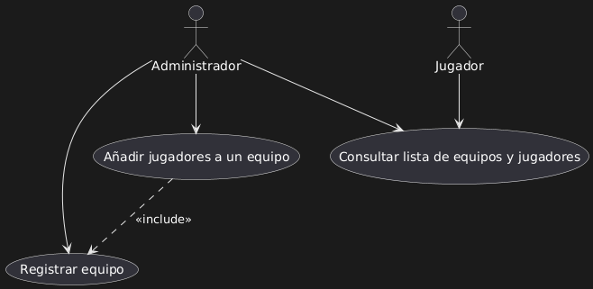
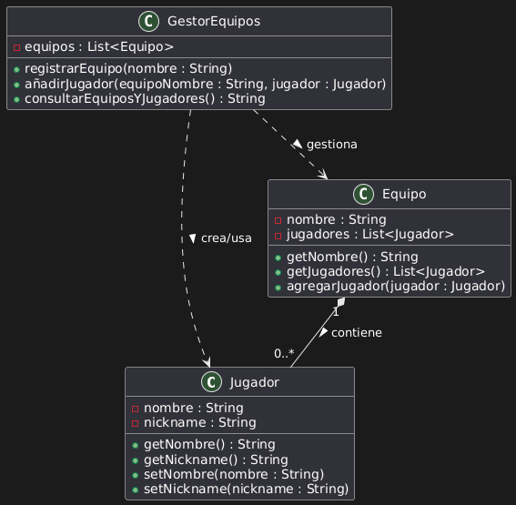

# Sistema de Gestión de Torneos de eSports

## Autora
Claudia Rodríguez Mayán 
[@ElCayi en GitHub](https://github.com/ElCayi)  

## Descripción

Este proyecto corresponde a la actividad sobre diseño con UML de la asignatura *Entornos de Desarrollo*.  
Se centra en el sistema de gestión de equipos y jugadores dentro de un torneo de eSports.  
No incluye código, solo el diseño estructural y funcional del sistema mediante diagramas UML.

---

## Diagramas UML

### Diagrama de Casos de Uso

Este diagrama representa qué puede hacer cada actor en el sistema.  
El Administrador puede registrar equipos, añadir jugadores y consultar la lista.  
El Jugador solo tiene acceso a la consulta.

 

---

### Diagrama de Clases

Se definen tres clases principales: `Jugador`, `Equipo` y `GestorEquipos`.  
Las dos primeras son entidades del sistema, y la tercera se encarga de gestionar las operaciones relacionadas.

 

---

## Justificación del diseño

He intentado seguir una estructura modular dividiendo las clases según su función.  
Los jugadores están contenidos dentro de los equipos, y el gestor actúa como clase de control.  
Decidí que era apropiado que los jugadores pudieran consultar la información de equipos y compañeros en el torneo, aunque sin permisos de edición, basándome en mis experiencias personales.

---

## Conclusiones

- Me ha ayudado a familiarizarme con las herramientas y los diagramas UML. El concepto de diagrama en general me chifla. 
- He aprendido a representar relaciones como composición y asociaciones entre clases.
- He vuelto a tener conflictos entre el repositorio remoto y local (cómo no)
- En general, me ha parecido interesante y creo que con práctica podría integrar estos modelos en futuros proyectos más completos.

---

## Estructura del proyecto

torneo-esports-uml/
├── diagrams/
│   ├── casos-uso.png
│   ├── clases.png
├── README.md

